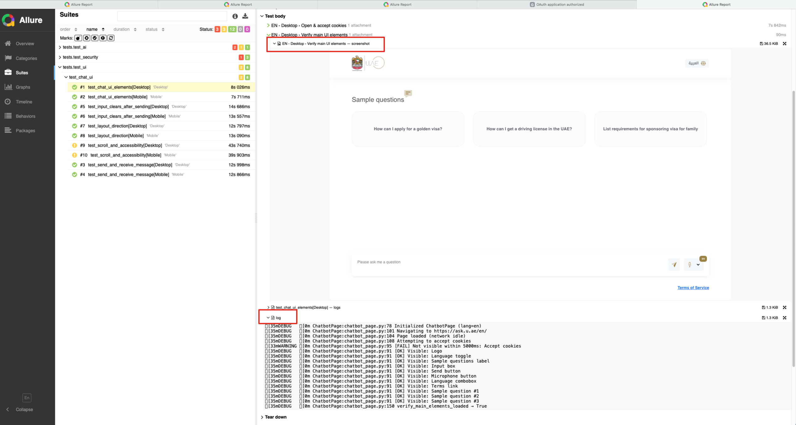
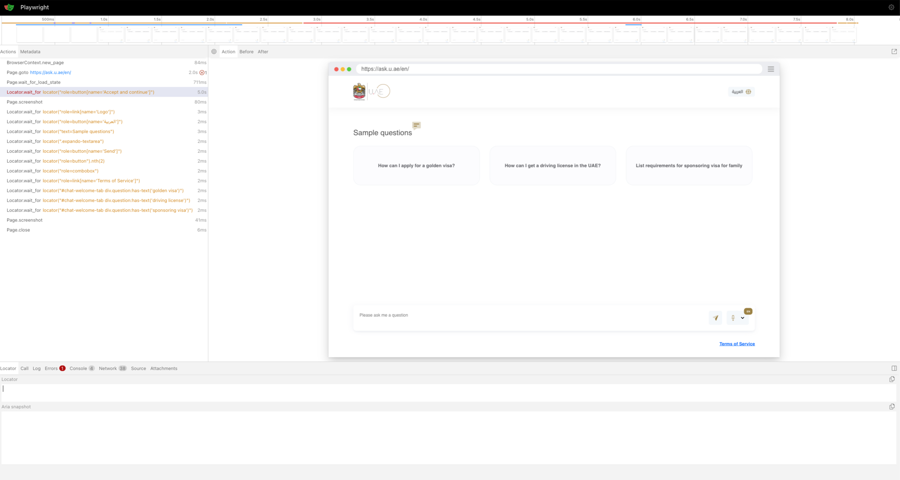

# U-Ask QA Automation Framework

An end-to-end QA automation suite for the [U-Ask](https://ask.u.ae) generative AI chatbot, built using **Python**, **Pytest**, **Playwright**, and **Allure**.

This framework tests UI behavior, AI response quality, and security handling across both **English** and **Arabic** interfaces. It is fully data-driven and traceable.

---

## Features

### Framework
- **Python + Pytest + Playwright** for robust browser automation
- **Allure** for structured reporting
- **Data-driven** prompts and multi-language support, you can config test language in config/config.py 

### Coverage
- **UI Behavior**: widget visibility, messaging, layout, accessibility
- **AI Response Validation**: keyword checks, hallucination avoidance, formatting
- **Security Testing**: injection resistance and sanitization

### Reporting & Debugging
- Allure reports with:
  - Step-by-step logs
  - Screenshots after each step
  - Full-page screenshots on failure
- Playwright trace files per test case

---

## Project Structure

```
uask_qa_automation/
├── config/                    # Environment & feature flags
│   └── config.py              # Language, Base URLs, timeouts, headless, storage settings
├── pages/                     # Page Object Models
│   └── chatbot_page.py
├── data/                      # Data-driven test inputs
│   └── test_data.json         # Prompts, expected keywords, thresholds
├── utils/                     # Helpers: reporting, AI comparison, payloads
│   ├── reporting.py           # Step context manager & reporting utilities
│   ├── setup_session.py # Manual CAPTCHA session initializer
│   └── logger.py              # Logging wrapper
├── tests/
│   ├── test_ui/               # UI behavior tests
│   │   └── test_chat_ui.py
│   ├── test_ai/               # AI response validation tests
│   │   └── test_chat_ai.py
│   └── test_security/         # Security & injection tests
│       └── test_chat_security.py
├── report/                    # Allure output directory
│   └── allure-results/
├── README.md                  # This file
└── pytest.ini                 # Pytest configuration (markers, pythonpath)
```

---

## Prerequisites

1. **Python 3.10+**, pip
2. **Playwright** browsers
3. **Allure** command-line tool

```bash
# Create & activate virtual environment (macOS/Linux)
python3 -m venv venv
source venv/bin/activate

# Install Python dependencies
pip install -r requirements.txt

# Install Playwright browsers
playwright install

# Install Allure (macOS)
brew install allure

```

---

## One-Time Setup: CAPTCHA Bypass

Before run the test scripts, run the setup script to manually solve any reCAPTCHA and persist session state:

```bash
cd uask_qa_automation
python -m utils.setup_session
```

This opens a headful browser, lets you solve the CAPTCHA, then saves `storage/auth.json`. Subsequent test runs will reuse this session to avoid further challenges.

---

## Running Tests

By default, tests run in **headful** mode for debugging. You can override via environment variables.

```bash
# Run all UI tests only
pytest tests/test_ui --alluredir=report/allure-results

# Run all tests
pytest tests --alluredir=report/allure-results
```

---

## Viewing Reports

After running tests, generate and view the Allure report:

```bash
allure serve report/allure-results

```
Detailed step-by-step replay for each test case

```
playwright show-trace report/traces/test_xxxx.zip
```
---


## Future Improvements

I allocated around 8 hours to this task, and given the constraints of using only the public production website (with CAPTCHA and no dedicated test environment), the AI validation had to be performed through the UI. While this was a practical approach within the time and access limitations, there are a few areas that could significantly improve the testing process moving forward:

1. **Switch to direct LLM API testing**
   If an API becomes available, AI validation should be moved away from the UI and instead rely on sending prompts directly to the language model. This would make tests faster, more reliable, and easier to scale.

2. **Introduce standard evaluation methods**
   Applying standard AI response evaluation methods, along with consistency and formatting checks, would improve the accuracy and automation of validation efforts.

3. **Integrate into CI/CD workflows**
   Integrate into CI/CD pipeline would ensure continuous quality checks and help detect issues early in the development cycle.

With these improvements in place, the testing framework would be more scalable, stable, and maintainable in the long run.

## Sample Test Result

Below is a sample test case result visualized:





